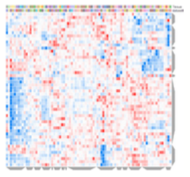

 Clustergrammer
================
Summary
----------------
Interactive hierarchical clustering heatmap visualization

Introduction
----------------
Clustergrammer is a web-based tool for visualizing and analyzing high-dimensional data as interactive and hierarchically clustered heatmaps.  It is commonly used to explore the similarity between samples in an RNA-seq dataset. In addition to identifying clusters of samples, it also allows to identify the genes which contribute to the clustering.

Results
----------------
The Clustergrammer plug-in embeds an interactive heatmap which displays gene expression for each sample in the RNA-seq dataset. Every row of the heatmap represents a gene, every column represents a sample, and every cell displays normalized gene expression values. The heatmap additionally features color bars beside each column which represent prior knowledge of each sample – for example, the tissue of origin or experimental treatment

Methods
----------------
The interactive heatmap was generated using Clustergrammer (<a href='#10.1038/sdata.2017.151'>Fernandez et al., 2017</a>) which is freely available at http://amp.pharm.mssm.edu/clustergrammer/. Prior to displaying the heatmap, the raw gene counts were normalized using the {normalization} method, filtered by selecting the {nr_genes} genes with most variable expression, and finally transformed using the Z-score method.