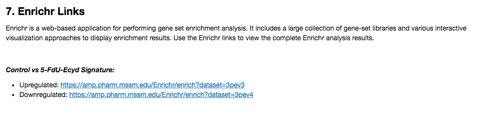

 Enrichr Links
================

Overview
----------------
Enrichment analysis is a statistical procedure used to identify biological terms which are over-represented in a given gene set. These include signaling pathways, molecular functions, diseases, and a wide variety of other biological terms obtained by integrating prior knowledge of gene function from multiple resources. Enrichr is a web-based application which allows to perform enrichment analysis using a large collection of gene-set libraries and various interactive approaches to display enrichment results.

How to Use the Plug-in
----------------
### Running the Analysis
```python
# Run Enrichr Links
enrichr_results = enrichr.run(dataset, geneset_size=500)
```

**Parameters**

| Name | Type | Values | Description |
| ---- | ---- | ------ | ----------- |
| **geneset_size** | *int* | *100, 250, 500 (default)* | Size of the gene set to be extracted to perform enrichment analysis |


### Plotting the Results
```python
# Plot Enrichr Links results
enrichr.plot(enrichr_results)
```
 
The Enrichr Links plug-in embeds links to the Enrichr web server which contain the results of enrichment analyses generated by analyzing the up-regulated genes and down-regulated genes identified from the Control vs Perturbation signature. By clicking on these links, users can interactively explore and download the results of the analysis.

Methods
----------------
The up-regulated and down-regulated gene sets were generated by extracting the {geneset_size} genes with the respectively highest and lowest values from the gene expression signature. The gene sets were subsequently submitted to Enrichr (<a href='10.1093/nar/gkw377'>Kuleshov et al., 2016</a>), which is freely available at <a href='http://amp.pharm.mssm.edu/Enrichr/'>http://amp.pharm.mssm.edu/Enrichr/</a>, using the gene set upload API. For more information on the methods used to generate the signature, see the Differential Gene Expression section.