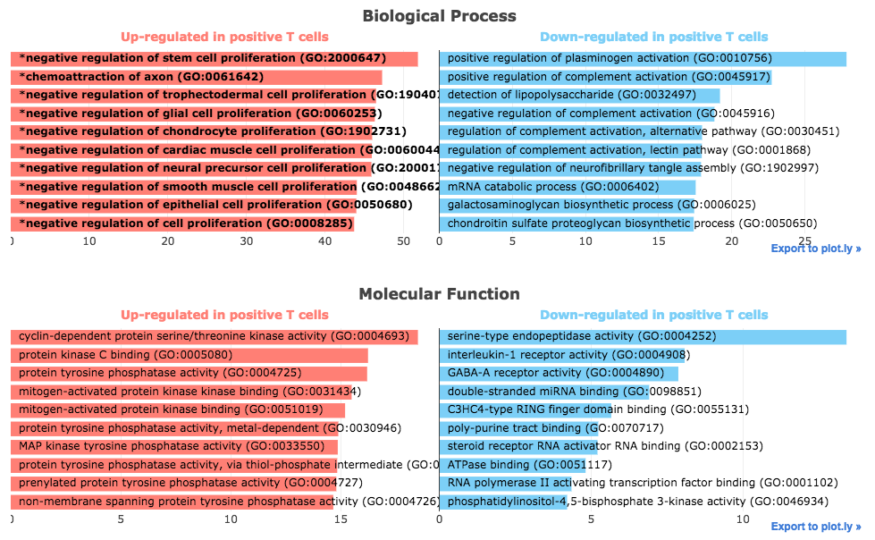

 Gene Ontology Enrichment Analysis Plug-in
================

Overview
----------------
Gene Ontology (GO) is a major bioinformatics initiative aimed at unifying the representation of gene attributes across all species. It contains a large collection of experimentally validated and predicted associations between genes and biological terms. This information can be leveraged by Enrichr to identify the biological processes, molecular functions and cellular components which are over-represented in the up-regulated and down-regulated genes identified by comparing two groups of samples.

Usage
----------------
### Running the Analysis
```python
# Run Gene Ontology Enrichment Analysis
go_enrichment_results = go_enrichment.run(enrichr_results)
```


### Plotting the Results
```python
# Plot Gene Ontology Enrichment Analysis results
go_enrichment.plot(go_enrichment_results)
```
 
The Gene Ontology Enrichment Analysis plug-in embeds interactive bar charts displaying the results of the Gene Ontology enrichment analysis generated using Enrichr. The x axis indicates the enrichment score for each term; significant terms are highlighted in bold. Results are grouped by library. Additional information about enrichment results is available by hovering over each bar