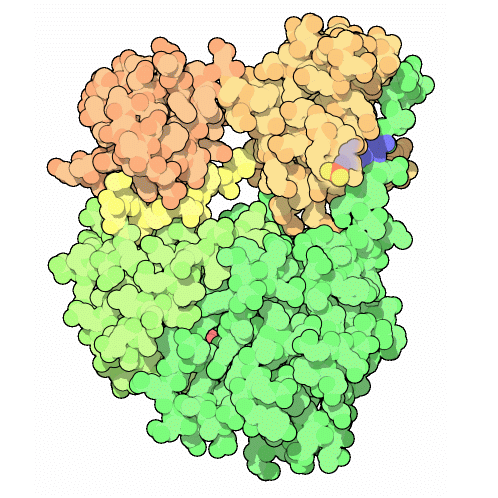
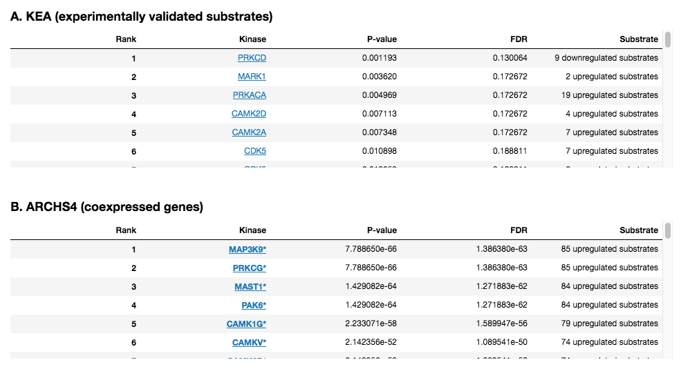

 Kinase Enrichment Analysis Plug-in
================

Overview
----------------
Protein kinases are enzymes that modify other proteins by chemically adding phosphate groups. Databases such as KEA contain a large number of associations between kinases and their substrates. This information can be leveraged by Enrichr to identify the protein kinases whose substrates are over-represented in the up-regulated and down-regulated genes identified by comparing two groups of samples.

Usage
----------------
### Running the Analysis
```python
# Run Kinase Enrichment Analysis
kinase_enrichment_results = kinase_enrichment.run(enrichr_results)
```


### Plotting the Results
```python
# Plot Kinase Enrichment Analysis results
kinase_enrichment.plot(kinase_enrichment_results)
```
 
The Kinase Enrichment Analysis plug-in embeds browsable tables displaying the results of the Protein Kinase (PK) enrichment analysis generated using Enrichr. Every row represents a PK; significant PKs are highlighted in bold. A displays results generated using KEA, indicating PKs whose experimentally validated substrates are enriched. C displays results generated using the ARCHS4 library, indicating PKs whose top coexpressed genes (according to the ARCHS4 dataset) are enriched.