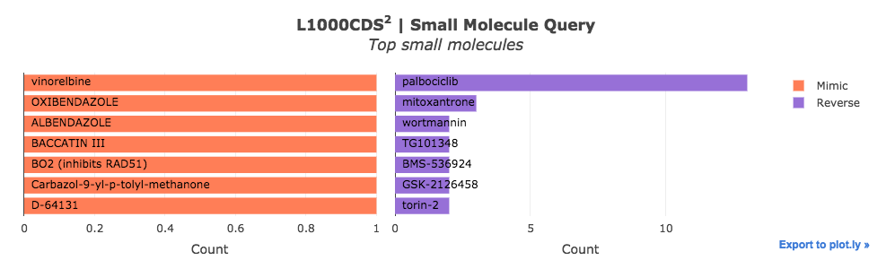

 L1000CDS2 Query Plug-in
================

Overview
----------------
L1000CDS2 is a web-based tool for querying gene expression signatures against signatures created from human cell lines treated with over 20,000 small molecules and drugs for the LINCS project. It is commonly used to identify small molecules which mimic or reverse the effects of a gene expression signature generated from a differential gene expression analysis.

Usage
----------------
### Running the Analysis
```python
# Run L1000CDS2 Query
l1000cds2_results = l1000cds2.run(signature)
```


### Plotting the Results
```python
# Plot L1000CDS2 Query results
l1000cds2.plot(l1000cds2_results)
```
 
The L1000CDS<sup>2</sup> plug-in embeds an interactive bar chart displaying the top small molecules which mimic or reverse the input gene expression signature.