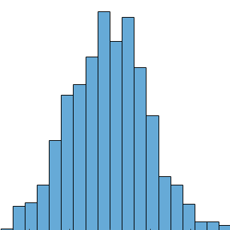
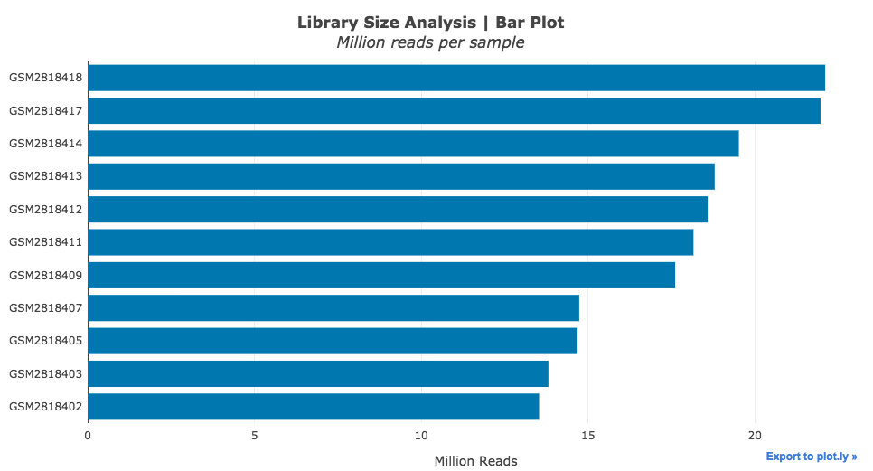

 Library Size Analysis Plug-in
================

Overview
----------------
In order to quantify gene expression in an RNA-seq dataset, reads generated from the sequencing step are mapped to a reference genome and subsequently aggregated into numeric gene counts. Due to experimental variations and random technical noise, samples in an RNA-seq datasets often have variable amounts of the total RNA. Library size analysis calculates and displays the total number of reads mapped for each sample in the RNA-seq dataset, facilitating the identification of outlying samples and the assessment of the overall quality of the data.

Usage
----------------
### Running the Analysis
```python
# Run Library Size Analysis
library_size_analysis_results = library_size_analysis.run(dataset)
```


### Plotting the Results
```python
# Plot Library Size Analysis results
library_size_analysis.plot(library_size_analysis_results)
```
 
The Library Size Analysis plug-in embeds an interactive bar chart which displays the total number of reads mapped to each RNA-seq sample in the dataset. Additional information for each sample is available by hovering over the bars. If provided, sample groups are indicated using different colors, thus allowing for easier interpretation of the results.