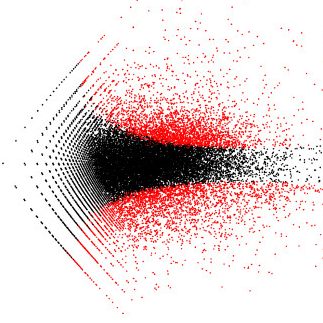
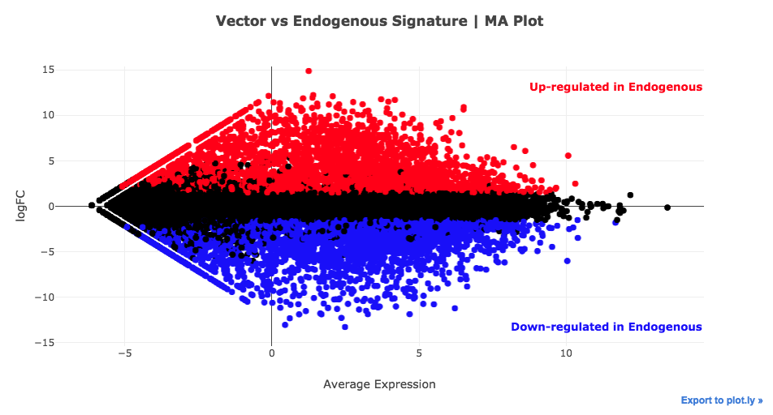

 MA Plot Plug-in
================

Overview
----------------
Volcano plots are a type of scatter plot commonly used to display the results of a differential gene expression analysis. They can be used to quickly identify genes whose expression is significantly altered in a perturbation, and to assess the global similarity of gene expression in two groups of biological samples. Each point in the scatter plot represents a gene; the axes display the average gene expression versus fold-change estimated by the differential expression analysis.

Usage
----------------
### Running the Analysis
```python
# Run MA Plot
ma_plot_results = ma_plot.run(signature, pvalue_threshold=0.05, logfc_threshold=1.5)
```

**Parameters**

| Name | Type | Values | Description |
| ---- | ---- | ------ | ----------- |
| **pvalue_threshold** | *float* | *0.01, 0.05 (default), 0.1* | P-value cutoff to display significant genes on the plot. |
| **logfc_threshold** | *float* | *1, 1.5 (default), 2* | Threshold of the absolute log2-Fold Changes to indicate differentially expressed genes. |


### Plotting the Results
```python
# Plot MA Plot results
ma_plot.plot(ma_plot_results)
```
 
The MA Plot plug-in embeds an interactive scatter plot which displays the average expression and statistical significance of each gene calculated by performing differential gene expression analysis comparing samples in the Control group to samples in the Perturbation group. Every point in the plot represents a gene; additional information for each gene is available by hovering over it.