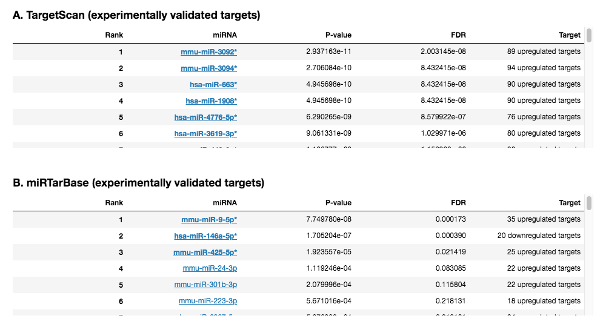

 miRNA Enrichment Analysis Plug-in
================

Overview
----------------
microRNAs (miRNAs) are small non-coding RNA molecules which play a key role in the post-transcriptional regulation of gene expression. Databases such as TargetScan and MiRTarBase contain a large number of associations between miRNAs and their targets. This information can be leveraged by Enrichr to identify the miRNAs whose targets are over-represented in the up-regulated and down-regulated genes identified by comparing two groups of samples.

Usage
----------------
### Running the Analysis
```python
# Run miRNA Enrichment Analysis
mirna_enrichment_results = mirna_enrichment.run(enrichr_results)
```


### Plotting the Results
```python
# Plot miRNA Enrichment Analysis results
mirna_enrichment.plot(mirna_enrichment_results)
```
 
The miRNA Enrichment Analysis plug-in embeds browsable tables displaying the results of the miRNA enrichment analysis generated using Enrichr. Every row represents a miRNA; significant miRNAs are highlighted in bold. A. displays results generated using the TargetScan library, B. displays results generated using the miRTarBase library.