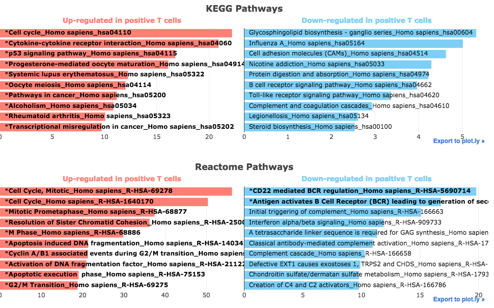

 Pathway Enrichment Analysis
================

Overview
----------------
Biological pathways are sequences of interactions between biochemical compounds which play a key role in determining cellular behavior. Databases such as KEGG, Reactome and WikiPathways contain a large number of associations between such pathways and genes. This information can be leveraged by Enrichr to identify the biological pathways which are over-represented in the up-regulated and down-regulated genes identified by comparing two groups of samples.

How to Use the Plug-in
----------------
### Running the Analysis
```python
# Run Pathway Enrichment Analysis
pathway_enrichment_results = pathway_enrichment.run(dataset)
```

**Parameters**


### Plotting the Results
```python
# Plot Pathway Enrichment Analysis results
pathway_enrichment.plot(pathway_enrichment_results)
```
 
The Pathway Enrichment Analysis plug-in embeds interactive bar charts displaying the results of the pathway enrichment analysis generated using Enrichr. The x axis indicates the enrichment score for each term; significant terms are highlighted in bold. Results are grouped by library. Additional information about enrichment results is available by hovering over each bar

Methods
----------------
Enrichment results were generated by analyzing the up-regulated and down-regulated gene sets using Enrichr. The following libraries were used for the analysis: KEGG_2016, Reactome_2016, WikiPathways_2016. Significant terms are determined by using a cut-off of p-value<0.1 after applying Benjamini-Hochberg correction. For more information on the methods used to perform the enrichment analysis, see the Enrichr section.