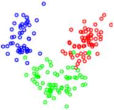
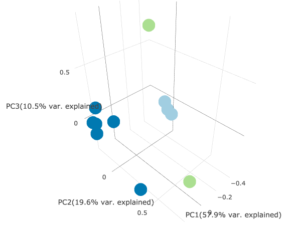

 PCA Plug-in
================

Overview
----------------
Principal Component Analysis (PCA) is a statistical technique used to identify global patterns in high-dimensional datasets. It is commonly used to explore the similarity of biological samples in RNA-seq datasets. To achieve this, gene expression values are transformed into Principal Components (PCs), a set of linearly uncorrelated features which represent the most relevant sources of variance in the data, and subsequently visualized using a scatter plot.

Usage
----------------
### Running the Analysis
```python
# Run PCA
pca_results = pca.run(dataset, nr_genes=2500, normalization=logCPM, z_score=True)
```

**Parameters**

| Name | Type | Values | Description |
| ---- | ---- | ------ | ----------- |
| **nr_genes** | *int* | *500, 2500 (default), 5000* | Number of most variably expressed genes to use for the analysis. |
| **normalization** | *str* | *logCPM (default), quantile, VST* | Normalization method for the dataset. |
| **z_score** | *bool* | *True (default), False* | Whether to perform Z-score on the rows of the normalized dataset. |


### Plotting the Results
```python
# Plot PCA results
pca.plot(pca_results)
```
 
The PCA plug-in embeds an interactive, three-dimensional scatter plot of the first three Principal Components (PCs) of the data. Each point represents an RNA-seq sample. Samples with similar gene expression profiles are closer in the three-dimensional space. If provided, sample groups are indicated using different colors, thus allowing for easier interpretation of the results.