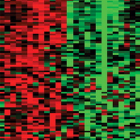
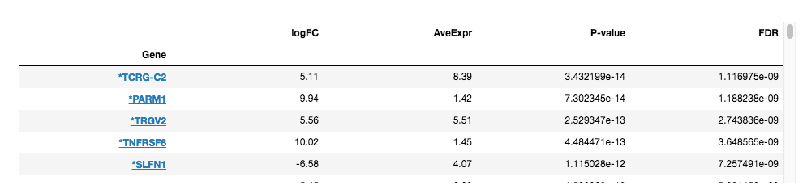

 Differential Expression Table Plug-in
================

Overview
----------------
Gene expression signatures are alterations in the patterns of gene expression that occur as a result of cellular perturbations such as drug treatments, gene knock-downs or diseases. They can be quantified using differential gene expression (DGE) methods, which compare gene expression between two groups of samples to identify genes whose expression is significantly altered in the perturbation. The signature table is used to interactively display the results of such analyses.

Usage
----------------
### Running the Analysis
```python
# Run Differential Expression Table
signature_table_results = signature_table.run(signature)
```


### Plotting the Results
```python
# Plot Differential Expression Table results
signature_table.plot(signature_table_results)
```
 
The Signature Table plug-in embeds an interactive, scrollable table which contains the results of a differential gene expression (DGE) analysis between two groups of samples in the dataset. Every row of the table represents a gene; the columns display the results of the differential gene expression analysis. Links to external resources containing additional information for each gene are also provided.