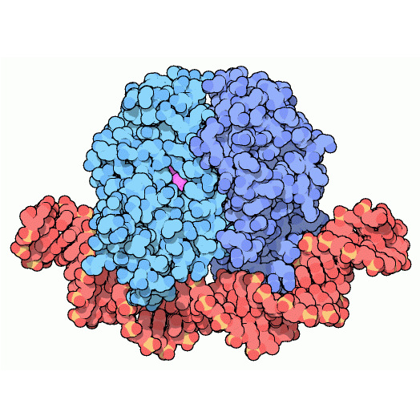
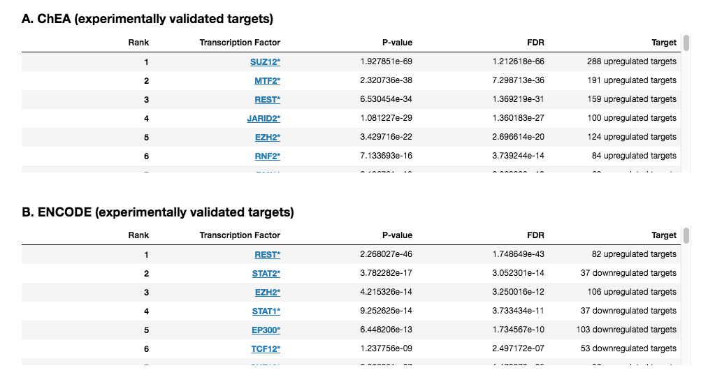

 Transcription Factor Enrichment Analysis Plug-in
================

Overview
----------------
Transcription Factors (TFs) are proteins involved in the transcriptional regulation of gene expression. Databases such as ChEA and ENCODE contain a large number of associations between TFs and their transcriptional targets. This information can be leveraged by Enrichr to identify the transcription factors whose targets are over-represented in the up-regulated and down-regulated genes identified by comparing two groups of samples.

Usage
----------------
### Running the Analysis
```python
# Run Transcription Factor Enrichment Analysis
tf_enrichment_results = tf_enrichment.run(enrichr_results)
```


### Plotting the Results
```python
# Plot Transcription Factor Enrichment Analysis results
tf_enrichment.plot(tf_enrichment_results)
```
 
The Transcription Factor Enrichment Analysis plug-in embeds scrollable tables displaying the results of the Transcription Factor (TF) enrichment analysis generated using Enrichr. Every row represents a TF; significant TFs are highlighted in bold. A and B display results generated using ChEA and ENCODE libraries, indicating TFs whose experimentally validated targets are enriched. C displays results generated using the ARCHS4 library, indicating TFs whose top coexpressed genes (according to the ARCHS4 dataset) are enriched.